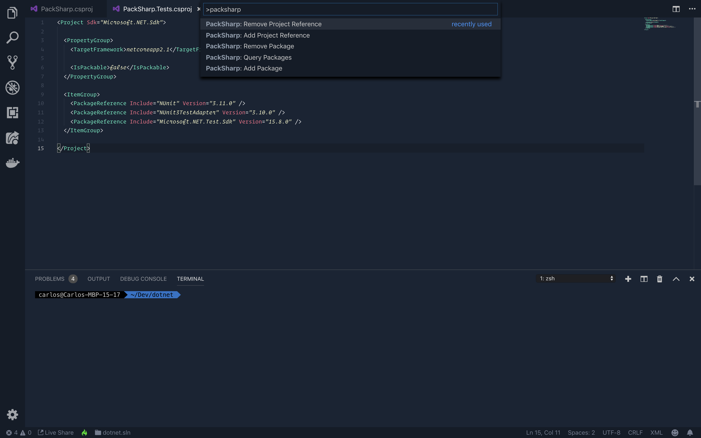

# Welcome to PackSharp

PackSharp is an extension that makes working with .NET Core's `dotnet` CLI commands much easier.

* Visually lists possible options so you can easily select what you want to do.
* Queries packages from the NuGet Repository so you can search and select the Package to use in a single command

The extension is a palette of commands. Simply open the Command Palette and type 'packsharp' to begin.

* Windows: CTRL + P
* Mac: SHIFT + CMD + P

## Features
Even though PackSharp abstracts complex logic behind the UI, each Palette Command will ultimately execute the appropriate `dotnet` CLI command in the integrated terminal.

It is always helpful to see the actual CLI commands being run so you are familiarized with them, but also in case someone else isn't using VS Code or you have a more complex issue to solve.

* NOTE: All PackSharp commands are run from the **Workspace Root**. If you need a more complicated file structure, then you will need to run the dotnet CLI commands manually, as needed.

----
## package.add
Add a NuGet Package to the selected Project.

* Using Palette Command => **PackSharp: Add Package**
* Turns to CLI Command  => `$ dotnet add [PROJECT] package [PACKAGE_NAME]`

----
## package.remove
Remove a NuGet Package from the selected Project.

* Using Palette Command => **PackSharp: Remove Package**
* Turns to CLI Command  => `$ dotnet remove [PROJECT] package [PACKAGE_NAME]`

----
## package.query
Return a list of NuGet Packages based on a search term.

* Palette Command => **PackSharp: Query Packages**
* No CLI Command  => Prints the results to the terminal

----
## package.list
List Packages from the selected Project.

* Palette Command => **PackSharp: List Packages**
* Turns to CLI Command  => `$ dotnet list [PROJECT] package`

----
## project.add
Add a Project Reference to the selected Project.

* Using Palette Command => **PackSharp: Add Project Reference**
* Turns to CLI Command  => `$ dotnet add [SELECTED_PROJECT] reference [PROJECT_TO_ADD]`

----
## project.remove
Remove a Project Reference from the selected Project.

* Using Palette Command => **PackSharp: Remove Project Reference**
* Turns to CLI Command  => `$ dotnet remove [SELECTED_PROJECT] reference [PROJECT_TO_REMOVE]`

----
## project.list
List the Project References from the selected Project.

* Using Palette Command => **PackSharp: List Project References**
* Turns to CLI Command  => `$ dotnet list [PROJECT] reference`

----
## bootstrap.selenium
This one command will bootstrap Selenium to the selected Project. It's never been easier to get started with Selenium in C#!

* Using Palette Command => **PackSharp: Bootstrap Selenium**
* Turns to:

    1. Selenium packages are installed
        * CLI Command => `dotnet add [PROJECT] package Selenium.WebDriver`
        * CLI Command => `dotnet add [PROJECT] package Selenium.Support`

    2. Downloads and adds latest stable version of chromedriver
        * A `/_drivers` directory is created at the workspack root
        * The chromedriver.zip is downloaded and the executable is extracted to `/_drivers`

    3. Start using Selenium!
        * Just point the `ChromeDriver()` to `/_drivers` and you're good to go!

----
## template.new
Create a Project, Config, or Solution with a simple command.
The dotnet templates can be found at their [dotnet new](https://docs.microsoft.com/en-us/dotnet/core/tools/dotnet-new) documentation.

* Using Palette Command => **PackSharp: Create New Project**
* Turns CLI Command => `$ dotnet new [TEMPLATE] --name [NAME]`

----
## Requirements

* This is a VS Code extension, so it requires VS Code.
* .NET Core v2.2 or greater
* (Recommended) C# Extension installed

## Known Issues

* PackSharp does not currently support other `dotnet` parameters like the "version" parameter in this example, `$ dotnet add [PROJECT] package [PACKAGE_NAME] --version 1.2.3`

* The NuGet query will return **up to 20** results. Each query will display an Information Message with a URL you can use to view additional results if the top 20 are insufficient.

* PackSharp is mainly tested in Unix environments. I will be making progress to ensure testing happens on Windows as well, but I expect there to be some issues there. Please report the issues on my email or on the repo.

* PackSharp runs the `dotnet` commands from your **Workspace Root**. Keep this in mind as you use the Palette Commands. You may need to run the commands in the CLI using your file structure.

## Release Notes

With the initial release of PackSharp, all questions and feedback are welcome! Please reach out to me on the GitHub repo or on the following platforms:

* Twitter : @CarlosKidman
* Email   : carlos@qap.dev

### 1.0.0

* Initial release of PackSharp!

### 1.1.0

* Bootstrap Selenium in a single command

### 1.2.1

* Use Project filepaths instead of just their name.

### 1.3.1

* Easily create projects using the new Palette Command: `PackSharp: Create New Project`

### 2.0.0

* List the Packages or References of a Project

### 2.1.0

* PackSharp inputs and options displayed will now persist even if focus is moved away.
