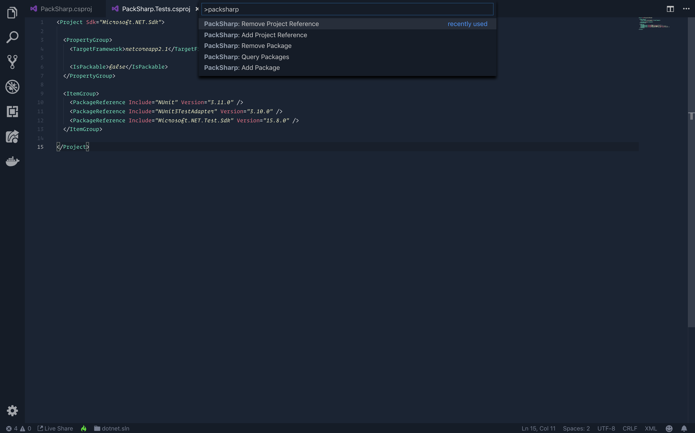

# Welcome to PackSharp

PackSharp is an extension that makes working with .NET Core's CLI commands for Packages (NuGet) and Projects easier. It does this in two ways:

* Lists possible references so you can easily select which Package or Project to use
* Queries packages from the NuGet Repository so you can search and select the Package to use in a single command

The extension is a palette of commands. Simply open the Command Palette (Shift + Command + P) and type 'packsharp' to begin.

## Features
Even though PackSharp abstracts complex logic behind the UI, each Palette Command will ultimately execute the appropriate `dotnet` CLI command in the integrated terminal.

It is always helpful to see the actual CLI commands being run so you are familiarized with them, but also in case someone else isn't using VS Code.

> There are two types of objects that PackSharp works with: _Package References_ and _Project References_.

#### package.add
----
Add a NuGet Package to the selected Project.

* Using Palette Command => **PackSharp: Add Package**
* Turns to CLI Command  => `$ dotnet add [PROJECT] package [PACKAGE_NAME]`

#### package.remove
----
Remove a NuGet Package from the selected Project.

* Using Palette Command => **PackSharp: Remove Package**
* Turns to CLI Command  => `$ dotnet remove [PROJECT] package [PACKAGE_NAME]`

#### package.query
----
Return a list of NuGet Packages based on a search term.

* Palette Command => **PackSharp: Query Packages**
* No CLI Command  => Prints the results to the terminal

#### project.add
----
Add a Project Reference to the selected Project.

* Using Palette Command => **PackSharp: Add Project Reference**
* Turns to CLI Command  => `$ dotnet add [SELECTED_PROJECT] reference [PROJECT_TO_ADD]`

#### project.remove
----
Remove a Project Reference from the selected Project.

* Using Palette Command => **PackSharp: Remove Project Reference**
* Turns to CLI Command  => `$ dotnet remove [SELECTED_PROJECT] reference [PROJECT_TO_REMOVE]`

## Requirements

* This is a VS Code extension, so it requires VS Code.
* .NET Core v2.1 or greater
* (Recommended) C# Extension installed

## Known Issues

* PackSharp does not currently support other `dotnet` parameters like the "version" parameter in this example, `$ dotnet add [PROJECT] package [PACKAGE_NAME] --version 1.2.3`

* The NuGet query will return **up to 20** results. Each query will display an Information Message with a URL you can use to view additional results if the top 20 are insufficient.

## Release Notes

With the initial release of PackSharp, all questions and feedback are welcome! Please reach out to me here or on the following platforms:

* Twitter : @CarlosKidman
* Email   : carlos@qap.dev

### 1.0.0

* Initial release of PackSharp!

### 1.1.0

* (Upcoming) Passing parameters to Palette Commands
* (Upcoming) Bootsrap Selenium WebDriver in a single command
